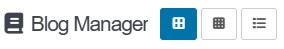
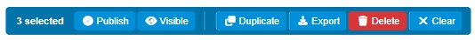

# Blog Manager Plugin for GRAV CMS


A Grav CMS plugin that provides a **dashboard for managing blog posts** directly in the admin panel. Browse posts in grid or list view, filter by date, category, tag, or language, create and duplicate posts, bulk export/import, and toggle publish/visible status inline—all without leaving the admin interface.

## Features

- 📋 **Three View Modes** - Big cards (2-col), small cards (4-col), and list view with column headers
- ✏️ **Native Editor** - Edit posts using Grav's built-in page editor
- ➕ **Create New Posts** - Auto-generates folder and frontmatter, redirects to native editor
- 📑 **Duplicate Posts** - Copies folder, appends "- copy" to title, unpublishes the duplicate
- 🗑️ **Delete with Modal** - Styled confirmation modal instead of browser alert
- 🔄 **Inline Status Toggle** - Click Published/Visible badges to toggle without page reload (in-place patch, no DOM re-render)
- 🔍 **Filter Panel** - Search by text, filter by Published, Visible, Category, Tag, and Date Range
- 📅 **Date Range** - Begin date and End date inputs for filtering posts by date
- 🖼️ **Thumbnail Images** - Auto-detects image field in frontmatter (primaryImage, image, header_image_file, etc.) with fallback to first media file and Grav placeholder
- 💾 **Persistent View** - Remembers selected view mode across sessions
- ✅ **Multi-Select** - Click to toggle, Shift+click for range selection of posts 
- ✅ **Bulk Actions** - Bulk Publish, Visible, Duplicate, Delete with confirmation modals from Multi-Select
- 📦 **Export & Import** - Export selected or all posts as ZIP; import from ZIP file with automatic folder creation
- 🔁 **Numeric Prefix Support** - Auto-detects Grav's numbered folders (e.g. `03.blog`) from the configured path
- 📂 **Language-Specific Items** - Supports blog's `item.md` and `item.{lang}.md` files
- 🌍 **Locale-Aware Dates** - Uses `Intl.DateTimeFormat` (dd/mm/yy for FR, mm/dd/yy for US, etc.)
- 🌐 **Full i18n** - All UI strings use Grav's translation system; JS receives translations via window variables
- 🎨 **External CSS** - Styles in a separate `blog-manager.css` file for browser caching and editor support
- 🌐 **Bilingual** - Full support for English and French

## What's New in v1.2.1

### Date Range Filter Update
- Replaced range calendar with two date input fields (Begin Date, End Date)
- Simpler, more standard HTML5 date inputs
- Calendar code preserved (commented out) for future re-enable

### Bug Fixes
- **YAML parsing errors**: Added try-catch around `Yaml::parse()` in PHP handlers to gracefully handle malformed frontmatter without 500 errors
- **File read errors**: Added file existence checks to prevent crashes on unreadable post files

## What's New in v1.2.0

### Export & Import
- **Export All** button in sidebar downloads all posts as a ZIP file
- **Export Selected** button in bulk action bar exports only selected posts
- ZIP contains full post folders (item.md, images, all media files)
- Filename: `blog-export-YYYY-MM-DD.zip`
- **Import** button in sidebar opens a `.zip` file picker
- Imported posts are placed in the blog directory with automatic duplicate name handling (appends `-2`, `-3`, etc.)
- Only directories containing `item*.md` are imported; others are skipped

### Skeleton Loading
- Replaced the full-screen spinner overlay with inline shimmer skeleton placeholders
- Skeleton cards match real card dimensions (image area, title, badges, excerpt, actions)
- Skeleton list rows match real list column proportions
- CSS `linear-gradient` animation sweeps every 1.8s
- No page flash — skeletons render instantly on init, replaced seamlessly when data loads

### Bug Fixes
- **Date range filter**: `dd/mm/yyyy` formatted dates now normalize to `yyyy-mm-dd` before comparison (previously caused incorrect filtering)
- **Card view tags**: now render as colored pills matching list view (was plain comma-separated text)

## Installation

### Manual Installation

1. Download the [latest release](https://github.com/DrDroid-FR/grav-plugin-blog-manager/releases/latest/)
2. Extract the archive to `user/plugins/`
3. Rename the folder to `blog-manager`
4. Clear the Grav cache

### Via GPM

```bash
bin/gpm direct-install https://github.com/DrDroid-FR/grav-plugin-blog-manager/releases/latest/download/blog-manager.zip
```

## Configuration

After installation, go to **Plugins** → **Blog Manager** to configure:

| Option | Description | Default |
|--------|-------------|---------|
| Plugin Enabled | Enable/disable the plugin | Yes |
| Blog Path | Route path to your blog page | /blog |
| Auto-detect blog on init | Scan for blog folder on plugin init. Re-runs when saving plugin settings. | Yes |
| Custom placeholder image | Upload a custom image for posts without a featured image | Grav logo |

**Note:** Saving the plugin settings triggers a re-scan of the pages directory for blog posts.

## User Manual

### Blog Detection

The plugin auto-detects your blog folder on initialization if **Auto-detect blog on init** is enabled. It scans `user/pages/` for a folder matching your configured `Blog Path` (e.g. `/blog`), stripping Grav's numeric prefixes (e.g. `03.blog` matches `/blog`).

`If your blog folder is not detected (e.g. after moving folders or changing the path), go to **Plugins** → **Blog Manager**, verify the **Blog Path** setting, and click **Save**. This triggers a re-scan of the pages directory.`

### Usage

#### Blog Manager Interface
Navigate to **Blog Manager** in the admin sidebar
Posts are loaded from your blog folder and displayed in the selected view mode
#### View Modes

- **Big Cards** (2 columns) - Full post cards with thumbnail, excerpt, and metadata
- **Small Cards** (4 columns) - Compact cards for quick scanning
- **List** - Table-style view with sortable columns
#### Post Actions
Click a **post title** or the **Edit** button to open it in Grav's native page editor
Click **Published** or **Visible** badges to toggle status
Use **Duplicate** to copy a post, or **Delete** to remove it permanently
#### Bulk Actions

Use top left **Tickbox** to select individual or multiple posts, **Shift+click** for selecting multiple posts range
Use the bulk action bar to Publish, toggle Visible, Duplicate, Bulk Export or Delete selected posts
#### Sidebar
Click **New Post** to create a new unpublished post via Grav's native page creation system, then redirect to the editor *
Use the export and import buttons to export all posts as a ZIP or import posts from a ZIP file
Use the filter panel to search, filter by status, date range, category, tag, or language

`
* Usage hint: 
When creating or editing a blog post, after saving, hit the back button to return to the blog manager.
I had the plan to recreate the post creation form in a modal but I choose not to do it to avoid code duplication and to keep the code efficient.
`

### Post Structure

Posts use Grav's numeric prefix folder format with `item.{language}.md`:

```
user/pages/
  {03.}blog/
    {01.}post-one/
      item.md
      item.fr.md
      pic01.jpg
    {02.}post-two/
      item.md
      item.en.md
```

The plugin scans the configured `blog_path` (e.g. `/blog`) and auto-detects the actual folder even if it uses a numeric prefix (e.g. `03.blog`). Language-specific item files (e.g. `item.fr.md`, `item.en.md`) are also supported.

## File Structure

```
blog-manager/
├── admin/pages/blog-manager.md       # Admin page definition
├── assets/
│   ├── blog-manager.css               # All plugin styles
│   ├── blog-manager.js                # Client-side logic (filters, views, AJAX)
│   └── images/
│       ├── grav-cms-logo.svg          # Default placeholder image
│       └── readme/...                 # README images
├── languages/
│   ├── en.yaml                        # English translations
│   └── fr.yaml                        # French translations
├── templates/blog-manager.html.twig   # Main template (HTML + Twig + JS i18n bridge)
├── blog-manager.php                   # Plugin class (events, handlers, YAML parsing)
├── blog-manager.yaml                  # Default config
├── blueprints.yaml                    # Plugin settings form
├── README.md
├── CHANGELOG.md
└── LICENSE
```

## Requirements

- Grav CMS 1.7+
- Admin Plugin 1.10+
- PHP 7.4+

## TODO

- [ ] Review the List View buttons with better responsive handling
- [ ] SVG plus icon for new post
- [ ] Dashboard widget for quick overview (number of posts, last x, title/Edit/NEW)
- [ ] Re-enable range calendar (currently using date inputs instead)

## Support

- **Issues:** https://github.com/DrDroid-FR/grav-plugin-blog-manager/issues
- **Author:** Julien Perret <gravdev@drdroid.fr>
- **GitHub:** https://github.com/DrDroid-FR

## License

MIT License - see [LICENSE](LICENSE) file for details.

---

Made with ❤️ by [Dr Droid](https://github.com/DrDroid-FR)

[](https://ko-fi.com/Y8Y61X0HB5)
